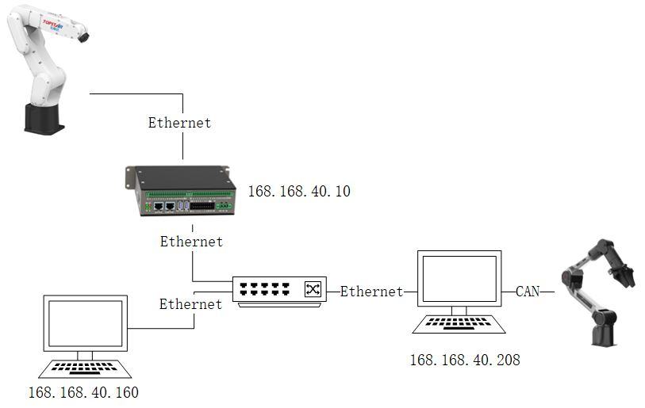
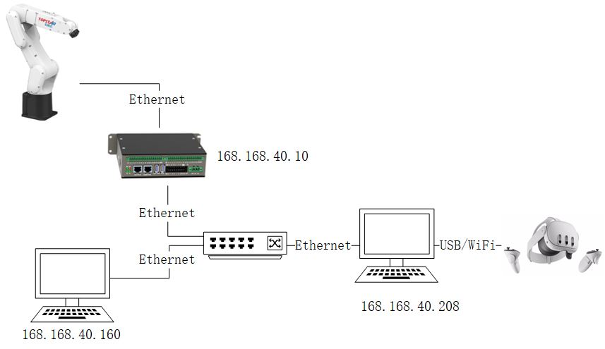

# 遥操机器人使用说明
## 0. 简介
此项目基于Topstar X5s控制器以及Piper机械臂和Oculus_quest进行开发，主要利用Piper机械臂获取其自身笛卡尔位姿坐标或者利用Oculus_quest获取手柄的位姿坐标，经过上位机程序的处理，通过API的实时接口将目标位姿坐标传递给X5s控制器，进而实现被控机械臂的运动。
## 1. 硬件连接

**Piper遥操设备硬件连接**



**Oculus_quest手柄硬件连接**


## 2. 软件配置
此项目在打了实时补丁的Ubuntu 24.04上开发，并且进行了测试，实时接口相关信息请参考官方文档。

**注意**：此项目开发虚拟环境通过conda进行管理，conda开发环境搭建可参考[链接](https://zhuanlan.zhihu.com/p/88458083)
### 2.1. 安装依赖
1.创建tele_robot环境并激活
```shell
conda env create -f tele_robot_env.yml
conda activate tele_robot
```
2.安装X5 API
```shell
pip install /your/path/to/x5_api
```
3.安装can工具（piper配置）
```shell
sudo apt update && sudo apt install can-utils ethtool
```
这两个工具用于配置 CAN 模块
如果执行bash脚本出现`ip: command not found`，请安装ip指令，一般是`sudo apt-get install iproute2`

4.配置can模块（piper配置）

同时激活多个can模块，**此处使用`can_config.sh`脚本**。逐个拔插can模块并一一记录每个模块对应的usb口硬件地址。在`can_config.sh`中，`EXPECTED_CAN_COUNT`参数为想要激活的can模块数量，现在假设为2

4.1.然后can模块中的其中一个单独插入PC，执行：

```shell
sudo ethtool -i can0 | grep bus
```
并记录下`bus-info`的数值例如`1-2:1.0`

4.2.接着插入下一个can模块。**注意**：不可以与上次can模块插入的usb口相同，然后执行：
```shell
sudo ethtool -i can1 | grep bus
```
**注意**：一般第一个插入的can模块会默认是can0，第二个为can1，如果没有查询到can可以使用`bash find_all_can_port.sh`来查看刚才usb地址对应的can名称预定义USB 端口、目标接口名称及其比特率

假设上面的操作记录的`bus-info`数值分别为`1-2:1.0`、`1-4:1.0`，则将下面的`USB_PORTS["1-9:1.0"]="can_left:1000000"`的中括号内部的双引号内部的参数换为`1-2:1.0`和`1-4:1.0`.

最终结果为：

`USB_PORTS["1-2:1.0"]="can_left:1000000"`

`USB_PORTS["1-4:1.0"]="can_right:1000000"`

4.3.看终端输出是否激活成功

执行`bash can_config.sh`

4.4.查看can是否设置成功

执行`ifconfig`查看是不是有`can_left`和`can_right`
进一步信息可参阅[链接](./doc/README.MD)

5.配置oculus

5.1.安装ADB模块

系统为linux的话，直接执行：
```shell
sudo apt install android-tools-adb
```
系统为windows的话，需要下载ADB模块，然后将adb.exe文件添加到环境变量中。可参考[链接](https://developer.android.google.cn/tools/releases/platform-tools?hl=zh-cn)

5.2. 若要使用oculus_quest遥操，必须要有oculus开发者账号，并且需要下载Meta Horizon软件，然后在软件中开启开发者模式。

5.3. 将oculus_quest连接到电脑上，然后在终端中执行：
```shell
adb devices
```
查看是否有新设备连接，如果有则表示连接成功。并在头显中接受usb_debug权限。
### 2.2.启动程序
进入项目文件夹，在tele_robot环境下执行:

1.首先需要找到tele_robot环境下python解释器的路径
```shell
which python
```
2.启动程序
```shell
sudo /path/to/venv/python rob_ctrl.py
```

**注意**：

1.启动程序时需要使用sudo权限，因为实时接口需要使用sudo权限。

使用piper时：

1.进入遥操模式时，请确保piper机械臂处于拖动模式，再进行上电进入遥操模式。

2.退出遥操模式时，请确保被控机械臂下电后，再让piper机械臂退出拖动模式。

使用oculus时：

1.进入遥操模式后，机器人上电后，手柄在控制机器人运动时，机器人有时不受手柄运动控制，此时不要急着移动手柄，下电机器人后，检查头显的摄像头能否拍到手柄，变动头显位置后，再激活模式操作机器人。


## 3. 项目目录
```shell
tele_robot
|--doc
|   |--can_activate.sh              # 激活单个can模块
|   |--can_config.sh                # 激活多个can模块
|   |--find_all_can_port.sh         # 查看所有can模块
|   |--README.MD                    # 说明文档
|--img                              # 图片
|--src                              # 源码
|   |--config                       # 设备和机器人配置
|   |   |-- tele_device_config.py   # 遥操设备配置(坐标转换关系配置)
|   |   |-- robot_config.py         # 机器人配置（安全空间配置）
|   |--get_stream                   # 数据流获取   
|   |   |-- piper_stream.py         # 获取piper机械臂数据流
|   |   |-- oculus_stream.py        # 获取oculus手柄数据流
|   |--action_wrapper               # 动作封装
|   |   |-- action_wapper.py        # 将遥操设备数据流封装为机器人的动作
|--rob_ctrl.py                      # 主程序
|--tele_robot_env.yml               # 环境配置文件
```